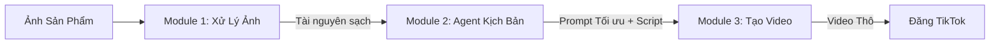

# Hệ Thống Tự Động Hóa Video TikTok - Tổng Quan Kiến Trúc

## 1. Triết Lý Hệ Thống
Hệ thống được thiết kế theo dạng đường ống (pipeline) mô-đun hóa, trong đó mỗi giai đoạn là một "Agent" hoặc "Dịch vụ" độc lập. Điều này cho phép thay thế công nghệ (ví dụ: đổi Model Video) mà không làm hỏng toàn bộ chuỗi.

Chúng ta sử dụng các công cụ được cung cấp làm nền tảng:
- **Bộ Não**: `veo3-workflow-agents` (Python) cho Kịch bản & Kỹ thuật Prompt.
- **Động Cơ**: `302_video_generator` (Next.js/API) làm cơ sở cho Tổng hợp Video.
- **Con Mắt**: Module Python tùy chỉnh để Nhận thức & Chuẩn bị Hình ảnh.

## 2. Quy Trình Tổng Quát (Global Workflow)


## 3. Chi Tiết Module

### Module 1: Con Mắt (Xử Lý Ảnh)
- **Mục tiêu**: Biến ảnh sản phẩm thô thành tài nguyên "chất lượng studio".
- **Công nghệ**: Python, `rembg` (Tách nền), `PIL` (Resize), `OpenCV` (Tăng cường).
- **Đầu ra**: Ảnh PNG tỷ lệ 9:16 (1080x1920) nền trong suốt hoặc nền được tạo AI.

### Module 2: Bộ Não (Kịch Bản & Prompt)
- **Mục tiêu**: Tạo kịch bản TikTok viral và prompt "chuẩn điện ảnh" cho AI Video.
- **Công cụ gốc**: `veo3-workflow-agents` (PydanticAI + Gemini).
- **Điều chỉnh**: Thích ứng `pydantic_ai_agents` để nhận diện *đặc tính sản phẩm* thay vì chủ đề chung.
- **Đầu ra**: JSON chứa:
    - `script_lines`: [Các câu thoại]
    - `video_prompt`: "Cảnh quay điện ảnh của [Sản phẩm], [Phong cách]..."

### Module 3: Động Cơ (Tổng Hợp Video)
- **Mục tiêu**: Biến Prompt + Ảnh thành Video.
- **Công cụ gốc**: `302_video_generator` (Mô hình API) hoặc `Veo3-Chain`.
- **Chiến lược**: Sử dụng mẫu tích hợp API từ `302_video_generator` (hỗ trợ Luma/Runway/Veo3) để tạo các đoạn video.
- **Đầu ra**: File Video MP4 (3 đoạn x 5-8 giây).

## 4. Cấu Trúc Thư Mục
```
root/
├── docs/               # Bạn đang ở đây (Tài liệu)
├── src/
│   ├── image_prep/     # Module 1
│   ├── script_agent/   # Module 2 (dựa trên veo3-workflow-agents)
│   └── video_engine/   # Module 3 (dựa trên logic 302_video_generator)
├── main.py             # Trình điều phối (Orchestrator)
└── requirements.txt
```
